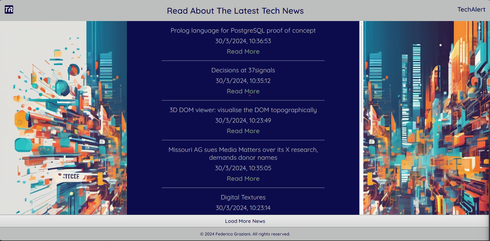

# TA - Tech Alert

Welcome to TA, where you can read about the latest tech news

---

## HOW IT WORKS

At the start, you will able to see the latest 10 news's title obtained from the service 'Hacker News'.

If you want read more about every single news just click on the "Read More" button, which allows you to access to the full news.

Click on the "Load More" button to load the next 10 news and scroll to see it.

---

## Used Technologies

- HTML
- CSS
- JavaScript
- Webpack
- Axios
- dotenv-webpack

---

## Struttura progetto

- index.html: contiene la struttura html del gioco;
- assets/css/styles.css: file css per gli stili;
- assets/js/script.js: file Javascript per la logica del gioco;
- assets/img/: cartella contenente l'immagine di sfondo del gioco.

---

## How To Use

> Clone this repository on your PC:
  git repo clone Federico-Gz/javascript-advanced-project
> Go the site:
  https://js-basics-a9e4b.web.app/